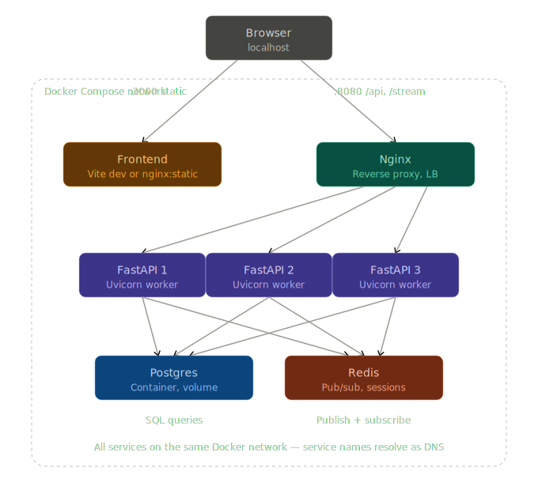
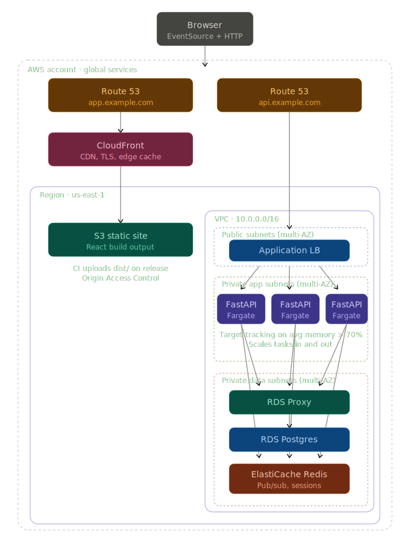

# ADR-000: Fleet Telemetry Monitoring Service — Summary

- **Status:** Accepted
- **Date:** 2026-05-21
- **Scope:** The one-page ADR required by the assignment. It answers the four
  required questions and links to the two detailed ADRs that contain the full
  reasoning and the load-bearing code/DDL.

**Detailed records (authoritative):**
- [`arch/ADR-001-realtime-dashboard-architecture.md`](arch/ADR-001-realtime-dashboard-architecture.md) — push transport, cross-worker fanout, sessions.
- [`arch/ADR-002-database-and-concurrency.md`](arch/ADR-002-database-and-concurrency.md) — persistence, schema, write-path concurrency.

---

## 1. The two or three most important decisions, and why

1. **Telemetry is the single source of truth — no denormalized `vehicles` table, no `zone_counters` table.**
   Per-vehicle current state is derived with `ORDER BY timestamp DESC LIMIT 1`; zone counts are a `GROUP BY zone_entered` over the event log. This makes the spec's hard requirement — *"guarantee every zone entry is counted"* — collapse into plain insert atomicity: each `zone_entered` is one row, so there is no counter row to contend on when many vehicles converge on a charging bay in the same second. It also makes out-of-order/retried events correct by construction instead of requiring guarded `UPDATE`s. (ADR-002 D2, D3.)

2. **The fault transition is guarded by the database, not by application logic.**
   `fault` → cancel active mission → create maintenance record runs in one `READ COMMITTED` transaction with `SELECT ... FOR UPDATE` on the mission row, and — critically — two **partial unique indexes** (`missions_one_active_per_vehicle_idx`, `maintenance_one_open_per_vehicle_idx`) are the real guarantee. A racing duplicate fault hits the index and the `IntegrityError` is swallowed as a no-op. The lock is for performance; the index is for correctness. (ADR-002 D4.)

3. **Server→client updates use SSE, fanned across workers by Redis Pub/Sub.**
   A dashboard is a one-way push problem, so SSE (plain long-lived HTTP, native `EventSource` reconnect, standard auth) beats WebSockets' unused bidirectionality and beats polling's latency floor and idle cost. Because writes can land on any worker while a client is connected to another, each worker keeps an in-process bounded-queue client registry and one Redis subscriber task; publishes happen **after** commit. (ADR-001 D1, D2, D5.)

## 2. What was unclear, and/or what I assumed

The spec deliberately leaves these open; assumptions were made consistently with the ADRs (ADR-001 §10, ADR-002 §Open Assumptions):

- **"Anomaly" is undefined.** Assumed five concrete incident types — `OVER_SPEED_LIMIT`, `LOW_BATTERY`, `MOVEMENT_UNDER_FAULT`, `ERROR_CODE_PRESENT` (stateless) and `RAPID_BATTERY_DRAIN` (stateful vs. previous event). Detected synchronously inside the ingest transaction so incidents are queryable the instant `POST /telemetry` returns. (ADR-002 D5.)
- **Vehicle / mission lifecycle is unspecified.** Assumed vehicle IDs are opaque strings from the edge (no registration, no FK), and that missions are created out-of-band — so a few `current` missions are seeded at startup to give the fault path something to cancel.
- **Telemetry `timestamp` is wall-clock from the vehicle**, may arrive out of order; indexes are built for `ORDER BY timestamp DESC` regardless of insert order.
- **Retention / data lifecycle was unspecified.** Assumed none is required for this slice. At 50 writes/sec a single unpartitioned `telemetry_events` table is fine for months, so range-partitioning by month (`pg_partman`, where retention becomes `DROP TABLE partition` instead of a locking `DELETE`) is deferred until a retention policy is actually defined.
- **Auth was scoped to storage, not issuance.** Sessions live in Redis with a TTL (`DEL` to invalidate); the actual login flow is stubbed.
- **Routes, channel names, and payload shapes** were undefined; chosen to fit ADR-001 §4–§7 (single channel, publish-after-commit, resync-on-connect).

## 3. What changes if scale grows "significantly"

"Significantly" = roughly **10k+ vehicles / ~10k writes/sec** — two-plus orders of magnitude past the current 50 vehicles. The application code does not change; what changes is the deployment topology, captured as the difference between **Diagram A (local Docker Compose)** and **Diagram B (AWS production)** below. The component *shapes* are identical — only the managed services and isolation boundaries differ — because local was deliberately built to mirror production (ADR-001 D4). Going from A to B:

- **Static frontend** — local: a frontend container (Vite dev / nginx static). AWS: the React build lives in an **S3 bucket** served through **CloudFront** (CDN, TLS, edge cache) with Origin Access Control.
- **DNS / TLS / edge** — local: plain `localhost`. AWS: **Route 53** (`app.` and `api.` records) with TLS terminated at the CloudFront/edge layer.
- **Reverse proxy / load balancer** — local: a single **Nginx** container. AWS: an **Application Load Balancer** in multi-AZ public subnets (target-group stickiness for SSE).
- **API tier** — local: a fixed set of **3 Uvicorn worker** containers. AWS: **autoscaling FastAPI tasks on ECS Fargate** in private app subnets, target-tracking on avg memory > 70%.
- **Postgres** — local: a container with a volume, reached directly. AWS: **RDS Postgres** (multi-AZ) reached through **RDS Proxy**, in private data subnets.
- **Redis** — local: a container. AWS: **ElastiCache Redis** (multi-AZ with automatic failover).
- **Network isolation** — local: one flat Docker network. AWS: a **VPC** with public subnets (ALB only) and private app/data subnets spread across AZs.

The backend scales horizontally across either topology because the realtime layer is per-worker + Redis Pub/Sub, not shared state (ADR-001 D5).

### Present / local architecture (Docker Compose — Diagram A)

### Production / scaled architecture (AWS — Diagram B)

## 4. What I deliberately left out, and why

- **`vehicles` and `zone_counters` tables** — replaced by derived reads; their absence is a correctness feature, not a gap (ADR-002 D2/D3).
- **Redis-backed aggregate counters** — even the AWS design serves `GET /fleet/state` and `/zones/counts` as live SQL; moving per-status / zone counts into post-commit Redis counters (reusing the Redis already present for SSE fanout) is a deferred scale layer, adopted only once aggregate read latency becomes the bottleneck (ADR-002 §"What Changes at Significant Scale").
- **Ingest buffering (Kafka / Redis Streams)** — neither diagram includes a queue; the API writes straight through to Postgres. A buffer where the endpoint returns `202` and a worker pool drains into Postgres is deferred until ingest spikes exceed durable-write capacity (same §).
- **Windowed analytics / stream processor (Flink SQL)** — not built and not in either diagram; the spec asks only for point-in-time counts, not windowed aggregations (same §).
- **Timer-based anomalies (`STALE_TELEMETRY`)** — would need a background scheduler; the synchronous-on-ingest model covers the spec without it (ADR-002 D5).
- **Planned-route deviation incidents** — significant business logic (route modeling, debounce, alerting policy) for marginal value in this slice.
- **Telemetry partitioning / retention / dead-letter queue** — unnecessary at 50 writes/sec for months.
- **Real authentication / login UI** — session *storage* is implemented; *issuance* is stubbed (ADR-001 §10).
- **AWS deployment (Terraform/CDK), CI/CD, observability stack** — out of scope; Diagram B is documentation of the target, not provisioned infrastructure.
- **At-least-once delivery for SSE** — at-most-once is accepted; clients resync from a known-good baseline on every (re)connect (ADR-001 D6).

Budget was 5–6 hours; these omissions keep the slice complete-and-documented over complete-but-unexplained.
